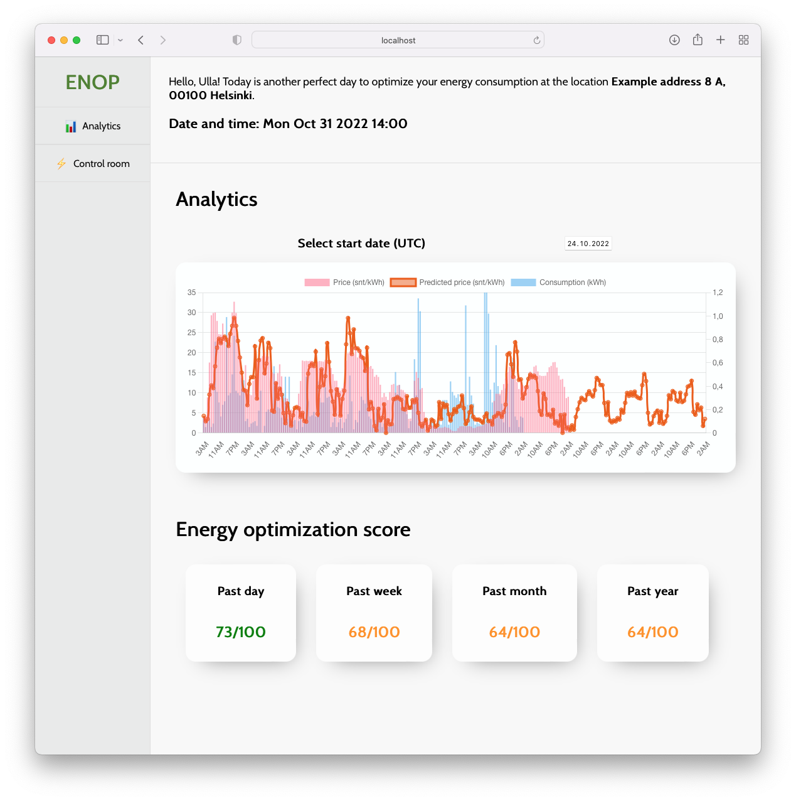

# ENOP - advanced machine learning aided ENergy OPtimization tool ⚡️🌿

Live preview available here 🔥: https://whale-app-c4q9y.ondigitalocean.app/

## 1. Introduction

The majority of Europe is highly dependent on Russia in terms of energy, and as we all know, the situation is currently far from ideal. Especially during this year, the price of electricity has risen because of the high demand for natural gas and uncertainty in the energy markets. Even Finland's transmission system operator (Fingrid Oyj) has announced that Finnish people should be prepared for electric outages during the coming winter [1].

It's self-evident that situations like these require fast, effective, and simple solutions so we don't have to suffer from electric outages and high electricity prices. In addition, solving issues has also a positive effect on reducing CO2 emissions: if we can schedule our consumption to the hours when the price of electricity is cheap, we are most likely using renewable energy sources, like wind power. In addition, smart scheduling like this brings also financial benefits.

This prototype project aims to solve **three** main problems related to the energy crisis:

1. _How can individuals and businesses have more freedom and power in optimizing their energy consumption?_
2. _How can everyone participate in energy savings effortlessly and intuitively?_
3. _What kind of tool/application would be ideal for these problems?_

In this guide we provide solutions to the aforementioned questions, discuss our approach to the problems, and finally, give instructions on how to play with the prototype tool.

## 2. Project description

Since the price of electricity is available only one day ahead, the first question that came to our mind was the following: How can individuals and businesses have more freedom and power in optimizing their energy consumption? This leads us to more questions: What is the most effective way to optimize energy consumption in order to save money? How can we support the grid's supply-demand-based stability? Can we optimize our energy consumption behavior to be more environmentally friendly?

In our solution, we decided to implement a machine-learning algorithm that can predict the price of electricity based on simple parameters: temperature, wind speed, date, and time. With this flexibility on the hand, individuals, businesses, schools, and factories can schedule their consumption with more freedom.

Knowing the electricity prices one day ahead can help a bit in optimization and bring savings, but what if prices are just between low and high today and tomorrow? How do you know if is it worth heating up the house, cranking up your water boilers, charging your electric vehicle (EV), and even possibly storing energy? What if the prices drop dramatically for the rest of the week? In such a case, you would probably want to consume energy moderately during today and tomorrow but consume more aggressively for the rest of the week. This type of next-level optimization is only possible through having reliable predictions, which our prototype provides.

This would even help environmentally: it's more environmentally friendly to consume energy during the low electricity prices since the prices are strongly affected by the amount of renewable energy source production.

The second point our team tackled was to come up with an idea on how can we get all, individuals and businesses to participate in saving energy. An average person doesn't how much is high consumption. What does it mean to consume 2 kWh or 2000 kWh in a certain time period? It is also difficult to estimate when is it cost- and environmentally-wise time to consume energy. We address this issue by first providing a simple **Energy Optimization Score (EOS)**, which is a number between 0-100. The higher the score, the more optimal the energy consumption behavior.

The score is based on a mathematical approach that we developed - it takes into account whether the energy is mainly consumed during pricy high-demand hours, which are not environmentally optimal, or if it's consumed during low-price high supply, and environmentally friendly hours. In other words, ideally, you would want to charge your EV, and heat up your house/building and water during the low-price hours: this way you save money, energy, the grid, and the environment!

Measure, track, reduce & repeat. It is as simple as that.

## 3. Approach

This section is divided into three parts. In the first subsection, the machine-learning-based technique is described. The second subsection describes the intuitive score Energy Optimization Score that we invented to help everyone participate in energy savings. Finally, the tool/application is presented in detail.

### 3.1. Machine-learning electricity price prediction

In order to predict the electricity prices in range more than one day ahead something about the underlying system must be understood. We know that the penetration of renewable energy sources, i.e., an increasing amount of wind power is affecting the prices. Thus, we decided to use wind speed measurements on the west shore of Finland. In addition, intuitively, the temperature affects the price quite a lot. Finally, the time of the day is the third point that must be taken into account.

The following data sources were used in this part:

1. ENTSO-e Transparency Platform for electricity prices in Finland [2]
2. Statistics Finland for weather observations [3]

The algorithm that we decided to use is called XGBoost [4].

### 3.2. Energy Optimization Score (EOS)

Since it's difficult to assess the quality of consumption even for engineers we decided to come up with something different. We utilize mathematical calculations to perform quality scores on past consumptions on different time scales. This way individuals and businesses can take, either manual or automatic action in order to improve the quality of consumption. In other words, the aim of this Energy Optimization score is to change behavior based on a simple number. The key thing to understand is that what you can't measure you can't manage.

The algorithm is as follows: first, we multiply price (in c/kWh) and consumption (in kWh) vectors in the given time range. Next, we calculate what would have been the optimum/worst consumption schedule for the period by sorting price and consumption vectors accordingly and multiplying the vectors. Finally, we can calculate the Energy Optimization Score, EOS.

The following data sources were used in this part:

1. ENTSO-e Transparency Platform for electricity prices in Finland [2]
2. Fingrid Datahub for fetching electricity consumption data [5]

### 3.3. Tool/Application

The tool/application should be effortless to use and easy to understand. Thus, we came up with a minimalistic solution that combines subsections 3.2. and 3.2. The application was built with React [6]. In the application, the user can view past consumption and price data. In addition, the predictions for the price of electricity are also presented. Finally, the Energy Optimization Scores for four different time intervals are presented on the main page. We can see that for this user, the consumption schedule has been quite good (73/100). However, the weekly, monthly, and yearly points might need some improvement. The tool uses a local data source, a JSON file, which contains the graph data.

Live preview is available here: https://whale-app-c4q9y.ondigitalocean.app/

## 4. Setup on local machine

If you want to play with the prototype on your local machine please follow the steps below:

1. clone/download the repository onto your device
2. cd into the project directory `junction-2022/enop-app`
3. install the needed dependencies with the command `npm install`
4. start the development server with the command npm start

## 5. References

[1] https://www.fingrid.fi/ajankohtaista/tiedotteet/2022/tulevan-talven-sahkon-riittavyydessa-useita-epavarmuustekijoita--suomalaisten-on-hyva-varautua-sahkopulan-aiheuttamiin-mahdollisiin-sahkokatkoihin/

[2] https://transparency.entsoe.eu/

[3] https://www.stat.fi/index_en.html

[4] https://www.nvidia.com/en-us/glossary/data-science/xgboost/

[5] https://www.fingrid.fi/en/electricity-market/datahub/

[6] https://reactjs.org/
